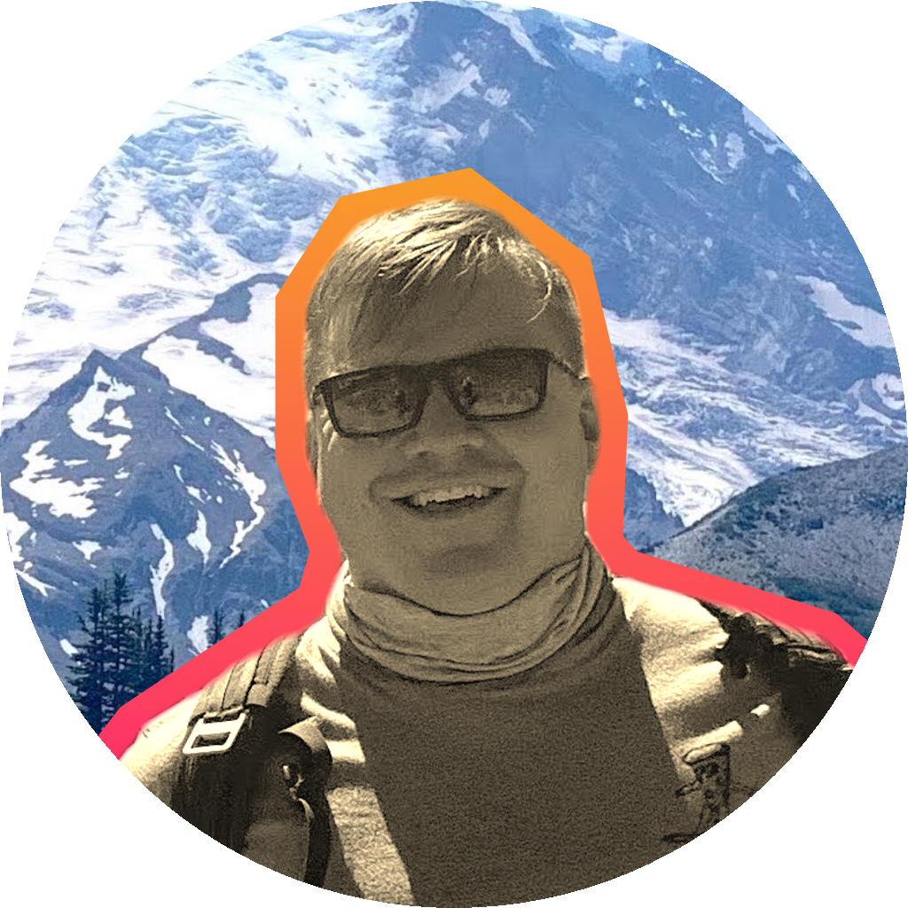

 
   

  

  

---

### I'm a Military Veteran  with 5+ of active duty experience seeking a career in Software Development .

I do my best work while solving problems in a demanding, project-oriented environment .

I have a team-first attitude with a passion for collaboration and continued learning.

 

---

-  I’m currently working most with ReactJS & Cypress E2E Testing.  
  

-  Let's talk about front-end development & creating the best possible UI/UX.  
  

-  Fun fact: In 2015, I received my NAUI open-water beginners SCUBA cert in Dubrovnik, Croatia.
  

   

## My Skill Set

<table><tr><td valign="top" width="33%">

### Technologies 

  
  
  
  
  
  
  
  
  
  
   
 
  
  

</td></tr></table>  

   

   

## Github Stats  

  

   

  
